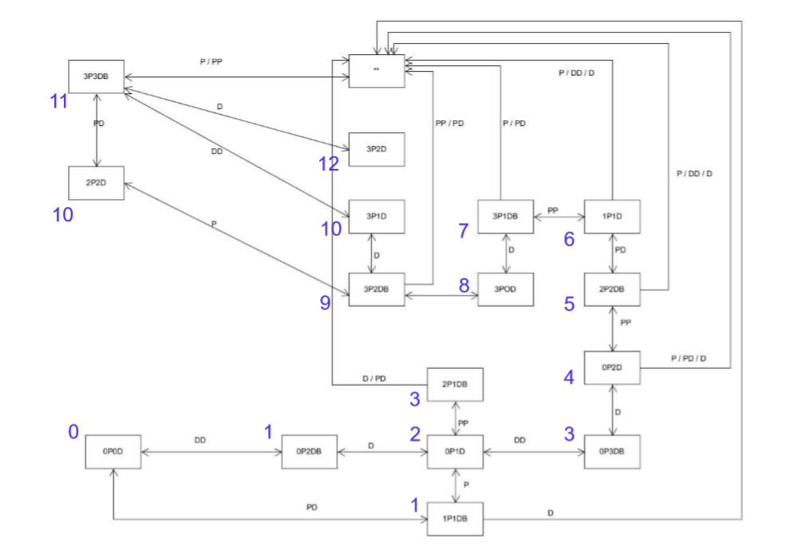

# Unty3D 牧师与魔鬼智能实现
## 作业要求
&emsp;P&D 过河游戏智能帮助实现  
- 实现状态图的自动生成  
- 讲解图数据在程序中的表示方法  
- 利用算法实现下一步的计算  

---
## 状态图  


---
## 基本原理
> 点击next之后，分析当前场景的状态，读取成功路径上的下一个状态，执行相应动作以达到下一个状态

---
## 代码实现
### 变量声明
&emsp;添加`antomove`类实现自动过河，声明相应的变量
```cs
    private int devilNum;
    private int priestNum;
    private int BoatCoast; 
    private enum Boataction {empty, P, D, PP, DD, PD }
    private bool isFinished = true;
    private Boataction nextState;
    private int count = 0;
    private int num = 0;
```

---
### `move`函数
&emsp;调用`getNext`函数，获取当前的`coaststate`,根据状态图得到下一步进程，并调用`DoAction`函数实现该动作
```cs
    public void move()
    {
        if (isFinished)
        {
            isFinished = false;
            Debug.Log(count);
            int[] fromCount = firstScene.fromCoast.GetobjectsNumber();
            priestNum = fromCount[0];
            devilNum = fromCount[1];
            BoatCoast = firstScene.boat.get_State();
            if (count == 0)
            {
                nextState = getNext();
                if ((int)nextState >= 3)
                {
                    num = 2;
                }
                else if ((int)nextState > 0) num = 1;
                else num = 0;
                count++;
            }
            Debug.Log("next state is " + nextState);
            DoAction();
        }
    }
``` 

---
### `getNext`函数
- 获取下一步的状态，进行的操作
```cs
    private Boataction getNext()
    {
        Boataction next = Boataction.empty;
        if (BoatCoast == 1)
        {
            if (devilNum == 3 && priestNum == 3)//3P3DB
            {
                next = Boataction.PD;
            }
            else if (devilNum == 2 && priestNum == 3)//3P2DB
            {
                next = Boataction.DD;
            }
            else if (devilNum == 1 && priestNum == 3)//3P1DB
            {
                next = Boataction.PP;
            }
            else if (devilNum == 2 && priestNum == 2)//2P2DB
            {
                next = Boataction.PP;
            }
            else if (devilNum == 3 && priestNum == 0)//3DB
            {
                next = Boataction.DD;
            }
            else if (devilNum == 1 && priestNum == 1)//1P1DB
            {
                next = Boataction.PD;
            }
            else if (devilNum == 2 && priestNum == 0)//2DB
            {
                next = Boataction.D;
            }
            else if (devilNum == 1 && priestNum == 2)//2P1DB
            {
                next = Boataction.P;
            }
            else if (devilNum == 2 && priestNum == 1)//1P2DB
            {
                next = Boataction.P;
            }
            else if (devilNum == 1 && priestNum == 0)//1DB
            {
                next = Boataction.D;
            }
            else if(devilNum == 3 && priestNum == 2)//2P3DB
            {
                next = Boataction.D;
            }
            else next = Boataction.empty;
        }
        else
        {
            if (devilNum == 2 && priestNum == 2)//2P2D
            {
                next = Boataction.empty;
            }
            else if (devilNum == 1 && priestNum == 3)//3P1D
            {
                next = Boataction.empty;
            }
            else if (devilNum == 2 && priestNum == 3)//3P2D
            {
                next = Boataction.D;
            }
            else if (devilNum == 0 && priestNum == 3)//3P
            {
                next = Boataction.empty;
            }
            else if (devilNum == 1 && priestNum == 1)//1P1D
            {
                next = Boataction.D;
            }
            else if (devilNum == 2 && priestNum == 0)//2D
            {
                next = Boataction.D;
            }
            else if (devilNum == 1 && priestNum == 0)//1D
            {
                next = Boataction.empty;
            }
            else next = Boataction.empty;
        }
        return next;
    }
``` 

---

### `DoAction`函数
&emsp;根据调用`getNext`函数得到的下一步状态自动生成点击执行动作完成智能过河实现对象上下船，船移动等事件
```cs
    private void DoAction()
    {
        if (count == 1 && num != 0)
        {
            if (nextState == Boataction.D)
            {
                devilOnBoat();
            }
            else if (nextState == Boataction.DD)
            {
                devilOnBoat();
            }
            else if (nextState == Boataction.P)
            {
                priestOnBoat();
            }
            else if (nextState == Boataction.PP)
            {
                priestOnBoat();
            }
            else if (nextState == Boataction.PD)
            {
                priestOnBoat();
            }
            count++;
        }
        else if (num == 2 && count == 2)
        {
            if (nextState == Boataction.DD)
            {
                devilOnBoat();
            }
            else if (nextState == Boataction.PP)
            {
                priestOnBoat();
            }
            else if (nextState == Boataction.PD)
            {
                devilOnBoat();
            }
            count++;
        }
        else if((num == 1 && count == 2) || (num == 2 && count == 3) || (num == 0 && count == 1))
        {
            firstScene.MoveBoat();
            count++;
        }
        else if ((num == 1 && count >= 3) || (num == 2 && count >= 4) || (num == 0 && count>=2))
        {
            GetOffBoat();
        }
        isFinished = true;
    }
```

---
### `DoAction`动作实现
- `GetOffBoat()`下船
```cs
    private void GetOffBoat()
    {
        if((priestNum == 0 && devilNum == 2) || (priestNum == 0 && devilNum == 0))
        {
            if (firstScene.boat.get_State() == -1)
            {
                foreach (var x in firstScene.boat.passenger)
                {
                    if (x != null)
                    {
                        firstScene.ObjectIsClicked(x);
                        break;
                    }
                }
                if (firstScene.boat.isEmpty()) count = 0;
            }
            else count = 0;
        }
        else if (((priestNum == 0 && devilNum == 1)) && firstScene.boat.get_State() == 1)
        {
            count = 0;
        }
        else
        {
            foreach (var x in firstScene.boat.passenger)
            {
                if (x != null && x.getType() == 1)
                {
                    firstScene.ObjectIsClicked(x);
                    count = 0;
                    break;
                }
            }
            if (count != 0)
            {
                foreach (var x in firstScene.boat.passenger)
                {
                    if (x != null)
                    {
                        firstScene.ObjectIsClicked(x);
                        count = 0;
                        break;
                    }
                }
            }
        }
    }
```
- `priestOnBoat()`牧师上船
```cs
    private void priestOnBoat()
    {
        if(BoatCoast == 1)
        {
            foreach(var x in firstScene.fromCoast.passengerPlaner)
            {
                if (x!=null && x.getType() == 0)
                {
                    firstScene.ObjectIsClicked(x);
                    return;
                }
            }
        }
        else
        {
            foreach (var x in firstScene.toCoast.passengerPlaner)
            {
                if (x != null && x.getType() == 0)
                {
                    firstScene.ObjectIsClicked(x);
                    return;
                }
            }
        }
    }
```
- `devilOnBoat()`魔鬼上船
```cs
    private void devilOnBoat()
    {
        if (BoatCoast == 1)
        {
            foreach (var x in firstScene.fromCoast.passengerPlaner)
            {
                if (x != null && x.getType() == 1)
                {
                    firstScene.ObjectIsClicked(x);
                    return;
                }
            }
        }
        else
        {
            foreach (var x in firstScene.toCoast.passengerPlaner)
            {
                if (x != null && x.getType() == 1)
                {
                    firstScene.ObjectIsClicked(x);
                    return;
                }
            }
        }
    }
```

---
### 接口和`GUI`更新
```cs
public interface UserAction
    {
        void MoveBoat();
        void ObjectIsClicked(GameObjects characterCtrl);
        void Restart();
        void Next();
    }
```

---
[视频链接](https://v.qq.com/x/page/c3030w2tu92.html?&ptag=4_7.7.1.23013_copy
)
