# Homework 2
## 1.简答题
- 解释 游戏对象（GameObjects） 和 资源（Assets）的区别与联系  
【区别】  
<font color =red >GameObjects</font>使用来描述资源实例的数据，是游戏中的任何对象，游戏对象本身不做事情，是一个容器，保存着那些被称为components的块  
<font color =red >Assets</font>是存放于Unity工程assets目录里的磁盘文件，有些资源如sprite是原生的，有些资源如FBX文件需要经过Unity处理之后才能成为原生格式  
【联系】  
资源和游戏对象是一对多的关系，意味着一份资源文件包含了一份或者多个对象，GameObjects可以通过Assets保存

- 下载几个游戏案例，分别总结资源、对象组织的结构（指资源的目录组织结构与游戏对象树的层次结构）  
下载游戏案例 [MiniCar](https://github.com/zhxhxlzt/MiniCar)  
【资源的目录结构】  
包含文件夹Materials，Models，Prefabs，PreSet,Resources等  
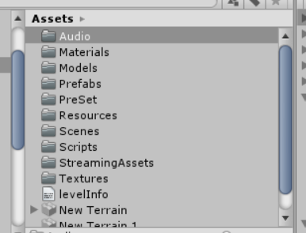    

  【游戏对象树的层次结构】

  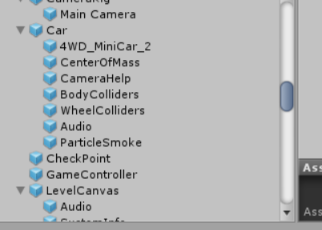
- 编写一个代码，使用 debug 语句来验证 MonoBehaviour 基本行为或事件触发的条件
  - 基本行为包括 Awake() Start() Update() FixedUpdate() LateUpdate()
  - 常用事件包括 OnGUI() OnDisable() OnEnable()  

```C# Script
using System.Collections;
using System.Collections.Generic;
using UnityEngine;

public class test : MonoBehaviour {

		void Awake()
		{
			Debug.Log("Awake");
		}
		void Start()
		{
			Debug.Log("Start");
		}
		void Update()
		{
			Debug.Log("Update");
		}
		void  FixedUpdate()
		{
			Debug.Log("FixedUpdate");
		}
		void  LateUpdate()
		{
			Debug.Log("LateUpdate");
		}
		
		void  OnGUI()
		{
			Debug.Log("OnGUI");
		}
		void OnDisable()
		{
			Debug.Log ("onDisable");
		}
		void OnEnable()
		{
			Debug.Log ("onEnable");
		}
}
```
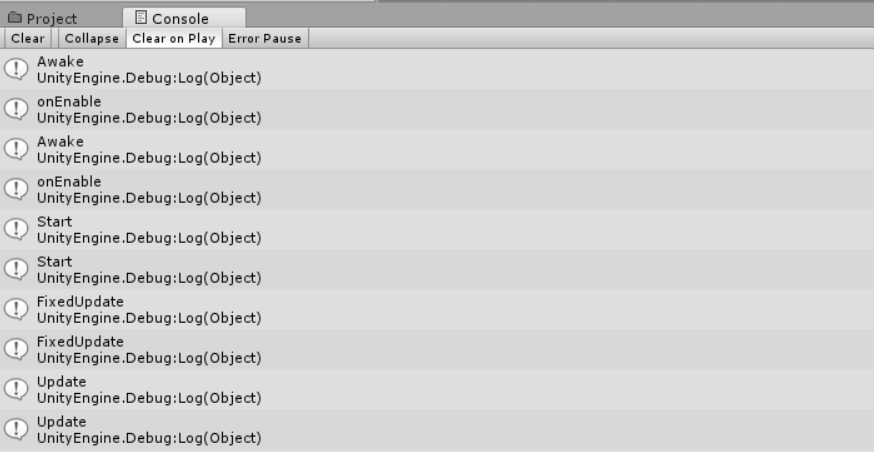
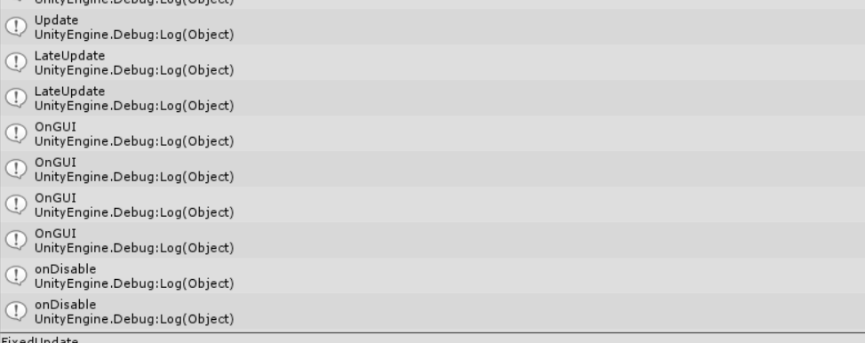


- 查找脚本手册，了解 GameObject，Transform，Component 对象
- Description  
  1.`Gameobject`are the fundamental objects in Unity that represent characters, props and scenery. They do not accomplish much in themselves but they act as containers for Components, which implement the real functionality.  
2.`Transform`：Position, rotation and scale of an object.  
3.`Component`：Base class for everything attached to GameObjects.  
 - 描述下图中 table 对象（实体）的属性、table 的 Transform 的属性、 table 的部件
  【图片作业链接没有，新建项目加入GameObject：`Cube`】  
   - `table属性`：Tag，Layer  
   - `table的Transform属性`：Position，Rotation，Scale  
   - `table的部件`：Cube（mesh filter），Box Collider，Mesh Renderer
 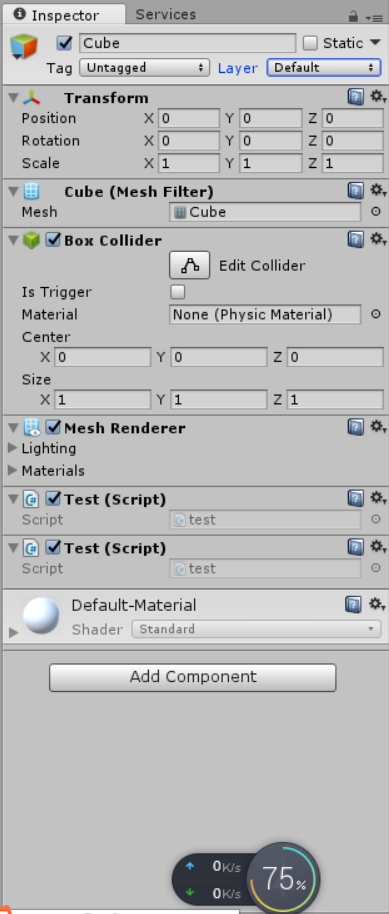
  - 用 UML 图描述 三者的关系（请使用 UMLet 14.1.1 stand-alone版本出图）
  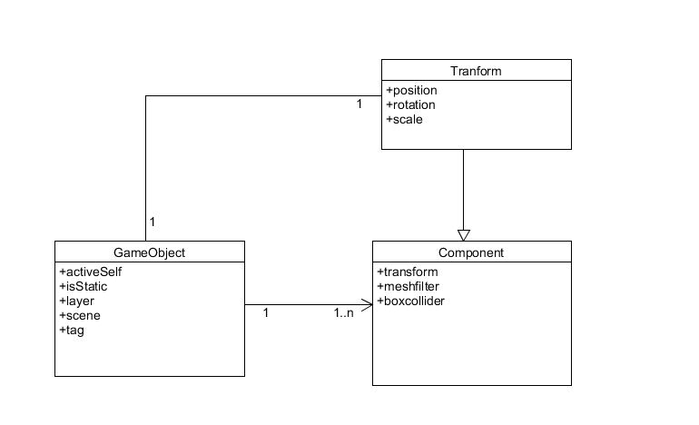
- 资源预设（Prefabs）与 对象克隆 (clone)
  - 预设（Prefabs）有什么好处？
  > Prefabs（预设）是一种可以被重复使用的游戏对象。当需要创建一些需要重复使用的对象时，就可以使用预设。
  - 预设与对象克隆 (clone or copy or Instantiate of Unity Object) 关系？
  >源预设修改，预设创建的对象也会被修改，对象克隆只是进行复制，克隆出的对象与原对象无联系
  - 制作 table 预制，写一段代码将 table 预制资源实例化成游戏对象
  >assets文件夹下面新建resources文件夹，将创建好的table对象拖进去
  >
  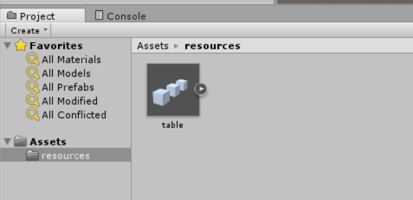
  >编写代码开始运行
  
```C
	void Start()
	{
		GameObject newtable = Instantiate(Resources.Load("table") as GameObject);
	}
```
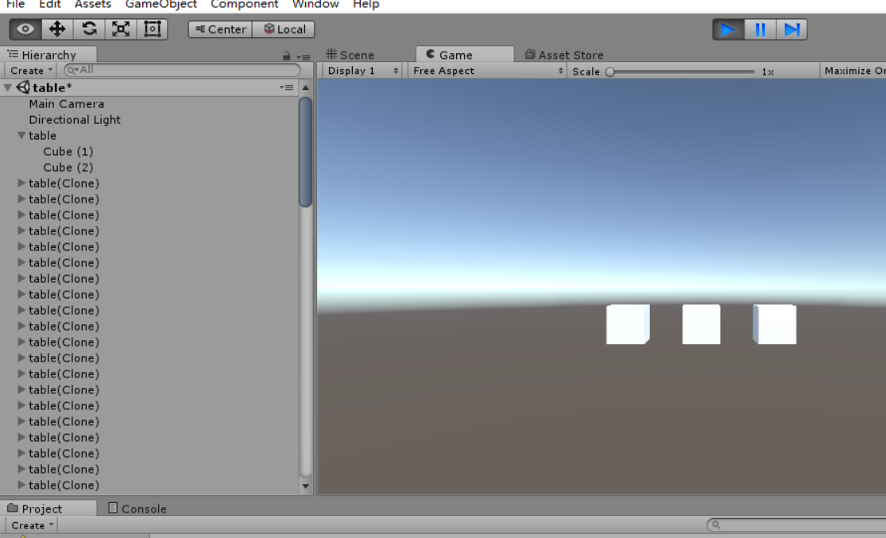
## 2.井字棋小游戏

`关键代码粘贴`  
判断游戏是否结束
```C# script
//judge result,4 for draw for the game
	int judge (){
		//Horizontal Direction Judgment
		for (int i = 0; i < 3; i++) {
			if(board[i,0] == board[i,1] && board[i,0] == board[i,2] && board[i,0] != 0){
				return board[i,0];
			}
		}
		//Vertical Direction Judgment
		for (int i = 0; i < 3; i++) {
			if (board[0,i] == board[1,i] && board[0,i] == board[2,i] && board[0,i] != 0 ){
				return board[0,i];
			}
		}
		//Diagonal Direction Judgment
		if(board[1,1]!=0 &&board[0,0]==board[1,1]&&board[1,1]==board[2,2]||board[2,0]==board[1,1]&&board[1,1]==board[0,2]){
			return board [1, 1];
		}
		for (int i = 0; i < 3; i++) {
			for (int j = 0; j < 3; j++) {
				if(board [i, j] == 0)
					return 0;
			}
		}
		return 3;
	}
	//start game,initialize
	void start (){
		reset ();
	}
	

```
 注意此时当judge函数判定游戏结束的时候，label显示游戏结果，并且不再允许玩家继续点击添加player（OorX）
```C# script
	void OnGUI(){
		//reset game if player click button
		if (GUI.Button (new Rect (Screen.width/2-50,Screen.height/2+100,100,25), "start game")) {
			reset ();
		}

		//judge the result of the game while update each time
		int temp = judge();
		if(temp == 1)GUI.Label(new Rect (Screen.width/2-40,Screen.height/2-150,150,75),"<color=red><size=25>O wins</size></color>");
		if(temp == 2)GUI.Label(new Rect (Screen.width/2-40,Screen.height/2-150,150,75),"<color=red><size=25>X wins</size></color>");
		if(temp == 3)GUI.Label(new Rect (Screen.width/2-40,Screen.height/2-150,150,75),"<color=red><size=25>Draw</size></color>");

		//Place chessmen while update each time
		for (int i = 0; i < 3; i++) {
			for (int j = 0; j < 3; j++) {
				if (board [i, j] == 1) {
					GUI.Button (new Rect (Screen.width / 2 - 75 + i * 50, Screen.height / 2 - 75 + j * 50, 50, 50), "O");
				} 
				else if (board [i, j] == 2) {
					GUI.Button (new Rect (Screen.width / 2 - 75 + i * 50, Screen.height / 2 - 75 + j * 50, 50, 50), "X");
				}
				else if (GUI.Button (new Rect (Screen.width / 2 - 75 + i * 50, Screen.height / 2 - 75 + j * 50, 50, 50), "")) {
					if(temp==0){
							if(turn==1){
								board[i,j] =1;
							}
							if(turn==-1){
								board[i,j]=2;
							}
							turn*=-1;
					}
				}
	    	}
		}
	}
```
参考了[相关博客](https://blog.csdn.net/marvelgl/article/details/60639308)并进行了修改（通过Screen.width和Screen.height进行了相关坐标计算）
- 游戏运行情况展示    
- [演示视频链接](https://v.qq.com/x/page/c09256t7bw3.html?&ptag=4_7.5.0.22257_copy)  
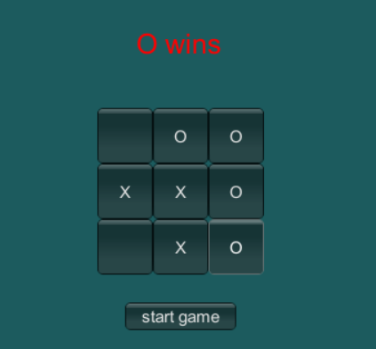  


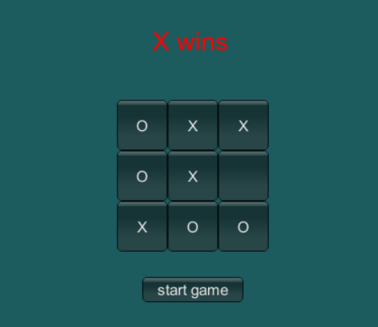


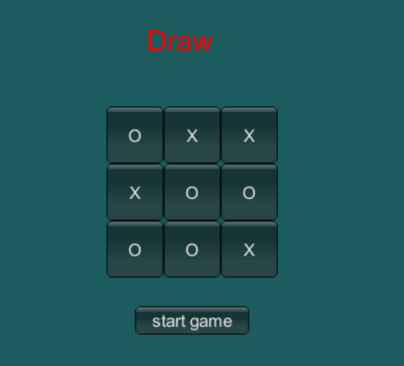
