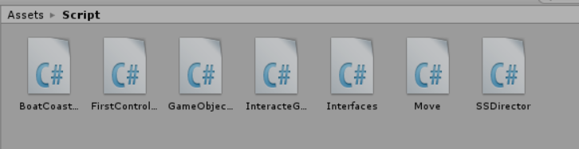
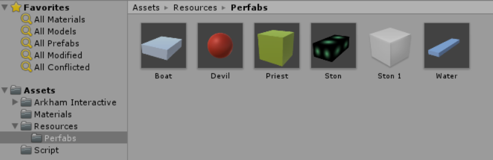
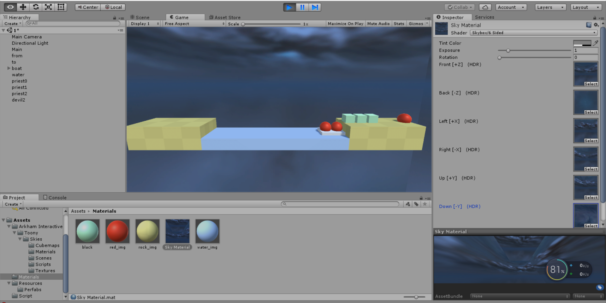
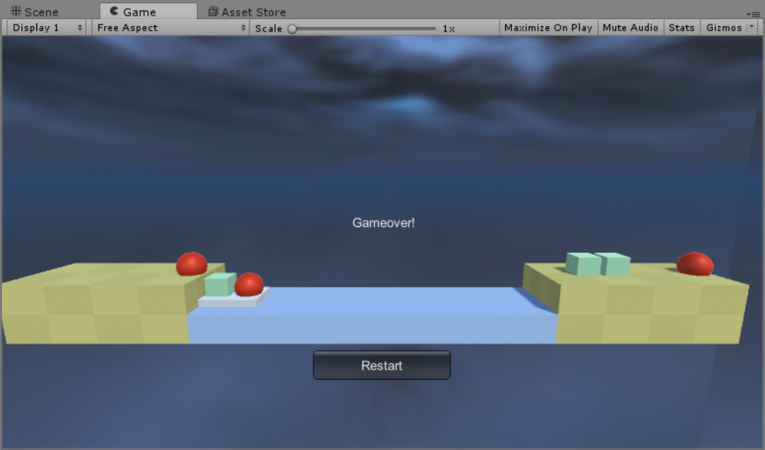
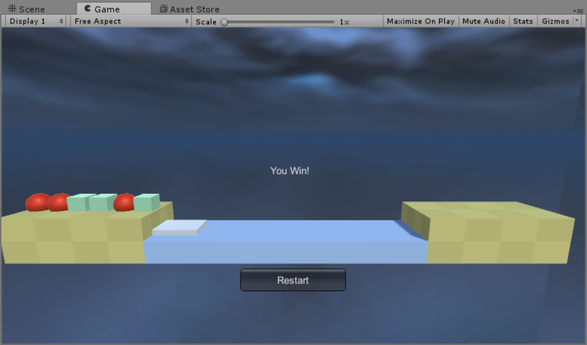

# Unity3D 牧师与魔鬼游戏
### 阅读游戏脚本
> Priests and Devils  

> Priests and Devils is a puzzle game in which you will help the Priests and Devils to cross the river within the time limit. There are 3 priests and 3 devils at one side of the river. They all want to get to the other side of this river, but there is only one boat and this boat can only carry two persons each time. And there must be one person steering the boat from one side to the other side. In the flash game, you can click on them to move them and click the go button to move the boat to the other direction. If the priests are out numbered by the devils on either side of the river, they get killed and the game is over. You can try it in many > ways. Keep all priests alive! Good luck!
### 程序需要满足的要求
- play the [game](http://www.flash-game.net/game/2535/priests-and-devils.html )
- 列出游戏中提及的事物（Objects）
- 用表格列出玩家动作表（规则表），注意，动作越少越好
- 请将游戏中对象做成预制
- 在 GenGameObjects 中创建 长方形、正方形、球 及其色彩代表游戏中的对象。
- 使用 C# 集合类型 有效组织对象
- 整个游戏仅 主摄像机 和 一个 Empty 对象， 其他对象必须代码动态生成！！！ 。 整个游戏不许出现 Find 游戏对象， SendMessage 这类突破程序结构的 通讯耦合 语句。 违背本条准则，不给分
- 请使用课件架构图编程，不接受非 MVC 结构程序
- 注意细节，例如：船未靠岸，牧师与魔鬼上下船运动中，均不能接受用户事件！
## 游戏中的对象
- boat
- coast
- river
- devil
- priest

## 玩家动作表格
|  玩家动作  | 发生条件  |结果      |
|  :-:    | :-:  | :-:  |
| 点击牧师  | 游戏没有结束,船有空位,船在岸边|     牧师移动 |
| 点击魔鬼| 游戏没有结束,船有空位,船在岸边|     魔鬼移动 |
| 点击船| 游戏没有结束船上有1人或两人 |船移动      |

## 游戏结构
> scripts文件夹结构  

  
> 预制  



> 一个较丑的SkyBox



> 导演SSDirector使用单实例模式保证导演实例有且仅有一个,职责如下:

    - 获取当前游戏的场景
    - 控制场景运行、切换、入栈与出栈
    - 暂停、恢复、退出
    - 管理游戏全局状态
    - 设定游戏的配置
    - 设定游戏全局视图
```C#
        public class SSDirector : System.Object {

        private static SSDirector _instance;

        public ISceneController currentScenceController { get; set; }
        public bool running { get; set; }

        public static SSDirector getInstance()
        {
            if (_instance == null)
            {
                _instance = new SSDirector();
            }
            return _instance;
        }

        public int getFPS()
        {
            return Application.targetFrameRate;
        }

        public void setFPS(int fps)
        {
            Application.targetFrameRate = fps;
        }
    }
```
> 接口ISceneController和UserAction分别提供场景加载和游戏对象响应函数的接口：
```C#
	public interface ISceneController
	{
		void LoadResources();  //load resources
	}

	public interface UserAction
	{
		void MoveBoat();//move the boat
		void ObjectIsClicked(GameObjects characterCtrl);
		void Restart();//restart game
	}

```
> 场记FirstController用来实例化接口IscnenComtroller和UserAction,实现对所有游戏对象的控制，根据controller提供的信息来进行实现函数调用
- 资源加载,响应用户点击对象事件,检查游戏状态
```C#
using System.Collections;
using System.Collections.Generic;
using UnityEngine;
using Interfaces;

public class FirstController : MonoBehaviour, ISceneController, UserAction
{
	InteracteGUI UserGUI;
	public CoastController fromCoast;
	public CoastController toCoast;
	public BoatController boat;
	private GameObjects[] GameObjects;

	void Awake()
	{
		SSDirector director = SSDirector.getInstance();
		director.currentScenceController = this;
		UserGUI = gameObject.AddComponent<InteracteGUI>() as InteracteGUI;
		GameObjects = new GameObjects[6];
		LoadResources();
	}

	public void LoadResources()
	{
		fromCoast = new CoastController("from");
		toCoast = new CoastController("to");
		boat = new BoatController();
		GameObject water = Instantiate(Resources.Load("Perfabs/Water", typeof(GameObject)), new Vector3(0, 0.5F, 0), Quaternion.identity, null) as GameObject;
		water.name = "water";
		for (int i = 0; i < 3; i++)
		{
			GameObjects s = new GameObjects("priest");
			s.setName("priest" + i);
			s.setPosition(fromCoast.getEmptyPosition());
			s.getOnCoast(fromCoast);
			fromCoast.getOnCoast(s);
			GameObjects[i] = s;
		}

		for (int i = 0; i < 3; i++)
		{
			GameObjects s = new GameObjects("devil");
			s.setName("devil" + i);
			s.setPosition(fromCoast.getEmptyPosition());
			s.getOnCoast(fromCoast);
			fromCoast.getOnCoast(s);
			GameObjects[i + 3] = s;
		}
	}

	public void ObjectIsClicked(GameObjects Objects)
	{
		if (Objects.isOnBoat())
		{
			CoastController whichCoast;
			if (boat.get_State() == -1)
			{ // to->-1; from->1
				whichCoast = toCoast;
			}
			else
			{
				whichCoast = fromCoast;
			}

			boat.GetOffBoat(Objects.getName());
			Objects.moveToPosition(whichCoast.getEmptyPosition());
			Objects.getOnCoast(whichCoast);
			whichCoast.getOnCoast(Objects);

		}
		else
		{                                   
			CoastController whichCoast = Objects.getCoastController(); 

			if (boat.getEmptyIndex() == -1)
			{      
				return;
			}
			if (whichCoast.get_State() != boat.get_State())   // boat is not on the side of character
				return;

			whichCoast.getOffCoast(Objects.getName());
			Objects.moveToPosition(boat.getEmptyPosition());
			Objects.getOnBoat(boat);
			boat.GetOnBoat(Objects);
		}
		UserGUI.SetState = Check();
	}

	public void MoveBoat()
	{
		if (boat.isEmpty()) return;
		boat.Move();
		UserGUI.SetState = Check();
	}

	int Check()
	{   // 0->not finish, 1->lose, 2->win
		int from_priest = 0;
		int from_devil = 0;
		int to_priest = 0;
		int to_devil = 0;

		int[] fromCount = fromCoast.GetobjectsNumber();
		from_priest += fromCount[0];
		from_devil += fromCount[1];

		int[] toCount = toCoast.GetobjectsNumber();
		to_priest += toCount[0];
		to_devil += toCount[1];

		if (to_priest + to_devil == 6)      // win
			return 2;

		int[] boatCount = boat.GetobjectsNumber();
		if (boat.get_State() == -1)
		{   
			to_priest += boatCount[0];
			to_devil += boatCount[1];
		}
		else
		{   
			from_priest += boatCount[0];
			from_devil += boatCount[1];
		}
		if (from_priest < from_devil && from_priest > 0)
		{    
			return 1;
		}
		if (to_priest < to_devil && to_priest > 0)
		{
			return 1;
		}
		return 0;          
	}

	public void Restart()
	{
		boat.reset();
		fromCoast.reset();
		toCoast.reset();
		for (int i = 0; i < GameObjects.Length; i++)
		{
			GameObjects[i].reset();
		}
	}
}

```
> 控制对象(priest,devil,boat)的移动,该函数通过设定目的地(SetDestination)完成移动的设定

> 根据移动状态(Move_State)去判断变换(移动)方向
```C#
public class Move : MonoBehaviour
{

	readonly float Speed = 15;

	Vector3 Target;
	Vector3 Middle;
	int Move_State = 0;  // 0-no move, 1->object move , 2->boat move
	bool To_Middle = true;

	void Update()
	{
		if (Move_State == 1)
		{
			if (To_Middle)
			{
				transform.position = Vector3.MoveTowards(transform.position, Middle, Speed * Time.deltaTime);
				if (transform.position == Middle) To_Middle = false;
			}
			else
			{
				transform.position = Vector3.MoveTowards(transform.position, Target, Speed * Time.deltaTime);
				if (transform.position == Target) Move_State = 0;
			}
		}
		else if (Move_State == 2)
		{
			transform.position = Vector3.MoveTowards(transform.position, Target, Speed * Time.deltaTime);
			if (transform.position == Target)
			{
				To_Middle = true;
				Move_State = 0;
			}
		}
	}

	public void SetDestination(Vector3 Position)
	{
		if (Move_State != 0) return;
		Target = Middle = Position;
		To_Middle = true;
		if (transform.position.y == Target.y)
		{
			Move_State = 2;
		}
		else
		{
			Move_State = 1;
			if (transform.position.y < Target.y)
			{
				Middle.x = transform.position.x;
			}
			else if (transform.position.y > Target.y)
			{
				Middle.y = transform.position.y;
			}
		}
	}

	public void Reset()
	{
		Move_State = 0;
		To_Middle = true;
	}
}
```
> 通过构造函数进行初始化，然后实现了一些角色的运动函数，如setPosition(), moveToPosition()
```C#
using System.Collections;
using System.Collections.Generic;
using UnityEngine;

public class GameObjects
{
	readonly GameObject Instance;
	readonly Move Move;
	readonly ClickGUI clickGUI;
	readonly int characterType; // 0->priest, 1->devil

	bool _isOnBoat = false;
	CoastController coastController;


	public GameObjects(string Type)
	{

		if (Type == "priest")
		{
			Instance = Object.Instantiate(Resources.Load("Perfabs/Priest", typeof(GameObject)), Vector3.zero, Quaternion.identity, null) as GameObject;
			characterType = 0;
		}
		else
		{
			Instance = Object.Instantiate(Resources.Load("Perfabs/Devil", typeof(GameObject)), Vector3.zero, Quaternion.identity, null) as GameObject;
			characterType = 1;
		}
		Move = Instance.AddComponent(typeof(Move)) as Move;

		clickGUI = Instance.AddComponent(typeof(ClickGUI)) as ClickGUI;
		clickGUI.setController(this);
	}

	public void setName(string name)
	{
		Instance.name = name;
	}

	public void setPosition(Vector3 pos)
	{
		Instance.transform.position = pos;
	}

	public void moveToPosition(Vector3 destination)
	{
		Move.SetDestination(destination);
	}

	public int getType()
	{   // 0->priest, 1->devil
		return characterType;
	}

	public string getName()
	{
		return Instance.name;
	}

	public void getOnBoat(BoatController boatCtrl)
	{
		coastController = null;
		Instance.transform.parent = boatCtrl.getGameobj().transform;
		_isOnBoat = true;
	}

	public void getOnCoast(CoastController coastCtrl)
	{
		coastController = coastCtrl;
		Instance.transform.parent = null;
		_isOnBoat = false;
	}

	public bool isOnBoat()
	{
		return _isOnBoat;
	}

	public CoastController getCoastController()
	{
		return coastController;
	}

	public void reset()
	{
		Move.Reset();
		coastController = (SSDirector.getInstance().currentScenceController as FirstController).fromCoast;
		getOnCoast(coastController);
		setPosition(coastController.getEmptyPosition());
		coastController.getOnCoast(this);
	}
}
```
> CoastController/BoatController
> 函数对相应的对象进行控制,创造空位置来存储队形从而判断位置状态,并提供方法为实例提供判断位置状态(展示CoastController.cs)
```C#
public class CoastController
{
	readonly GameObject coast;
	readonly Vector3 from_pos = new Vector3(9, 1, 0);
	readonly Vector3 to_pos = new Vector3(-9, 1, 0);
	readonly Vector3[] positions;
	readonly int State;    // to->-1, from->1

	GameObjects[] passengerPlaner;

	public CoastController(string _State)
	{
		positions = new Vector3[] {new Vector3(6.5F,2.25F,0), new Vector3(7.5F,2.25F,0), new Vector3(8.5F,2.25F,0),
			new Vector3(9.5F,2.25F,0), new Vector3(10.5F,2.25F,0), new Vector3(11.5F,2.25F,0)};

		passengerPlaner = new GameObjects[6];

		if (_State == "from")
		{
			coast = Object.Instantiate(Resources.Load("Perfabs/Ston", typeof(GameObject)), from_pos, Quaternion.identity, null) as GameObject;
			coast.name = "from";
			State = 1;
		}
		else
		{
			coast = Object.Instantiate(Resources.Load("Perfabs/Ston", typeof(GameObject)), to_pos, Quaternion.identity, null) as GameObject;
			coast.name = "to";
			State = -1;
		}
	}

	public int getEmptyIndex()
	{
		for (int i = 0; i < passengerPlaner.Length; i++)
		{
			if (passengerPlaner[i] == null)
			{
				return i;
			}
		}
		return -1;
	}

	public Vector3 getEmptyPosition()
	{
		Vector3 pos = positions[getEmptyIndex()];
		pos.x *= State;
		return pos;
	}

	public void getOnCoast(GameObjects ObjectControl)
	{
		int index = getEmptyIndex();
		passengerPlaner[index] = ObjectControl;
	}

	public GameObjects getOffCoast(string passenger_name)
	{   // 0->priest, 1->devil
		for (int i = 0; i < passengerPlaner.Length; i++)
		{
			if (passengerPlaner[i] != null && passengerPlaner[i].getName() == passenger_name)
			{
				GameObjects charactorCtrl = passengerPlaner[i];
				passengerPlaner[i] = null;
				return charactorCtrl;
			}
		}
		Debug.Log("cant find passenger on coast: " + passenger_name);
		return null;
	}

	public int get_State()
	{
		return State;
	}

	public int[] GetobjectsNumber()
	{
		int[] count = { 0, 0 };
		for (int i = 0; i < passengerPlaner.Length; i++)
		{
			if (passengerPlaner[i] == null)
				continue;
			if (passengerPlaner[i].getType() == 0)
			{   // 0->priest, 1->devil
				count[0]++;
			}
			else
			{
				count[1]++;
			}
		}
		return count;
	}

	public void reset()
	{
		passengerPlaner = new GameObjects[6];
	}
}
```

> GUI实现了交互GUI和响应用户点击游戏对象时间的ClickGUI,使用UserAction的接口控制游戏
增加了游戏状态提示标记Label和相应的Button

```C#
public class InteracteGUI : MonoBehaviour {
	UserAction UserAcotionController;
	public int SetState { get { return GameState; } set { GameState = value; } }
	static int GameState = 0;

	// Initialization
	void Start () {
		UserAcotionController = SSDirector.getInstance().currentScenceController as UserAction;
	}

	private void OnGUI()
	{
		if (GameState == 1)
		{
			GUI.Label(new Rect(Screen.width / 2 -30, Screen.height / 2 - 30, 100, 50), "Gameover!");
			if (GUI.Button(new Rect(Screen.width / 2 - 70, Screen.height / 2+110, 140, 30), "Restart"))
			{
				GameState = 0;
				UserAcotionController.Restart();
			}
		}
		else if (GameState == 2)
		{
			GUI.Label(new Rect(Screen.width / 2 - 30, Screen.height / 2 - 30 , 100, 50), "You Win!");
			if (GUI.Button(new Rect(Screen.width / 2 - 70, Screen.height / 2+110, 140, 30), "Restart"))
			{
				GameState = 0;
				UserAcotionController.Restart();
			}
		}
	}
}

public class ClickGUI : MonoBehaviour{
	UserAction UserAcotionController;
	GameObjects GameObjectsInScene;

	public void setController(GameObjects characterCtrl)
	{
		GameObjectsInScene = characterCtrl;
	}

	void Start()
	{
		UserAcotionController = SSDirector.getInstance().currentScenceController as UserAction;
	}

	void OnMouseDown()
	{
		if (gameObject.name == "boat")
		{
			UserAcotionController.MoveBoat();
		}
		else
		{
			UserAcotionController.ObjectIsClicked(GameObjectsInScene);
		}
	}
}
```

## 游戏运行截图
  


十分感谢此篇[参考博客](https://segmentfault.com/a/1190000014161302)    
[我的博客](https://blog.csdn.net/Passenger317_/article/details/101124080)  
[视频演示]()


