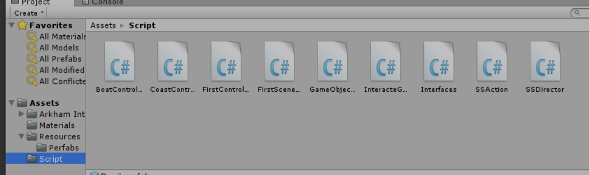
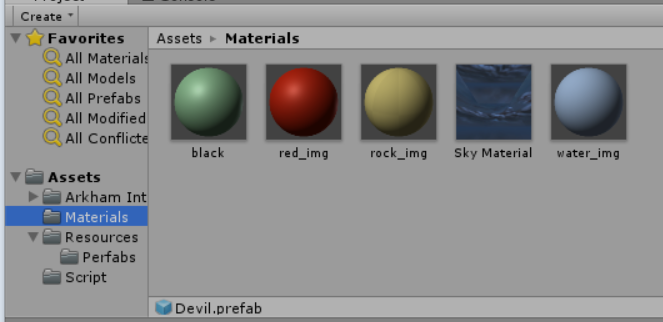
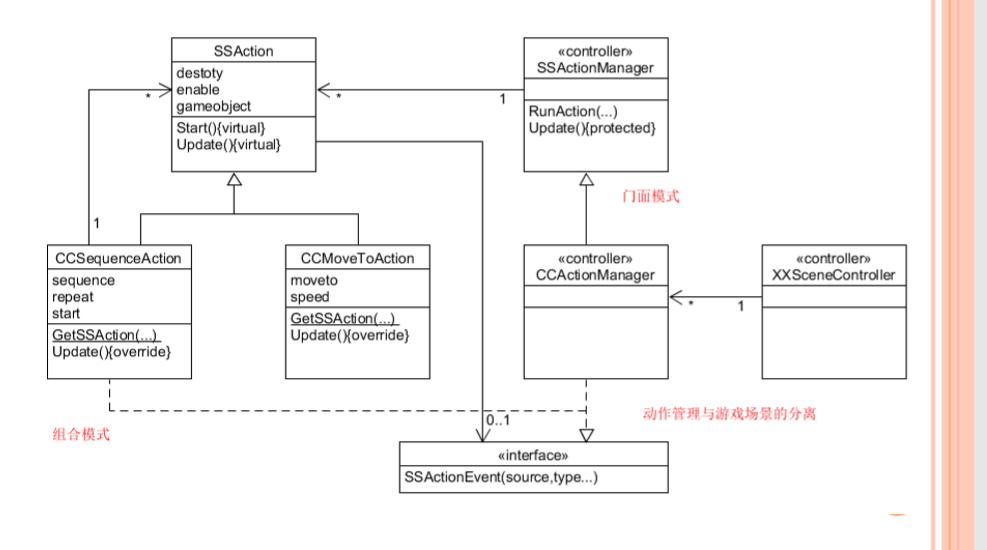
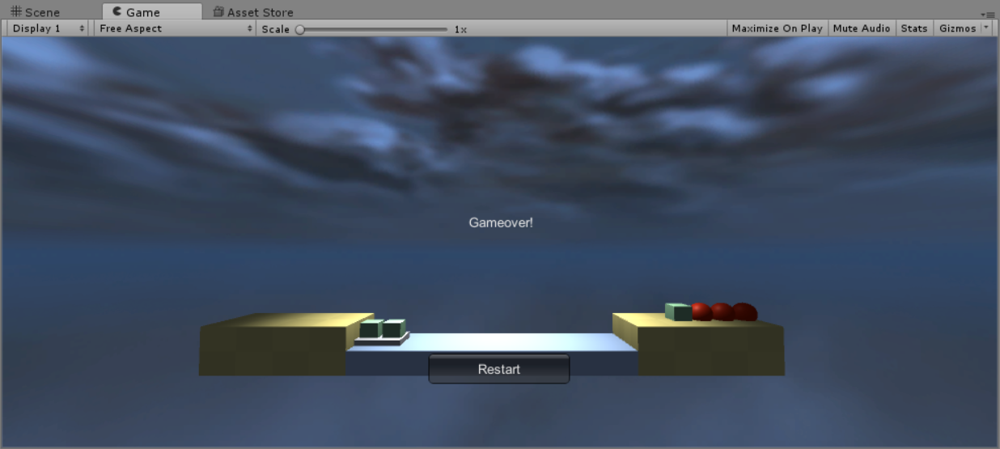
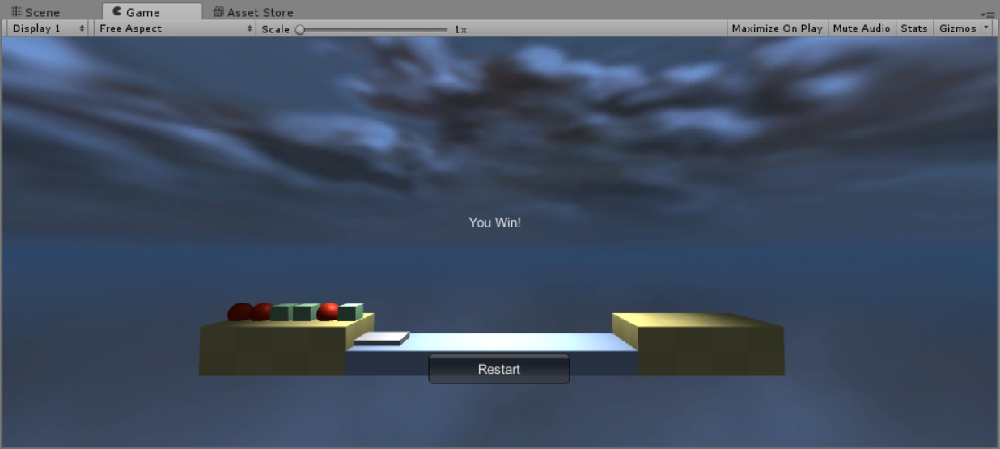

# 牧师与魔鬼 动作分离版
## 实验要求:
- 为牧师与魔鬼这个游戏设计一个裁判类，当游戏达到结束条件时，通知场景控制器游戏结束
## 实验目的:
- 将需要移动的游戏对象的动作提取出来,通过我们的动作管理器来统一管理不同的动作,实现游戏对象动作和物体属性的分离

### 文件目录


### UML图


#### SSAction 动作基类  
- 设计要点:  
1. ScriptableObject 是不需要绑定 GameObject 对象的可编程基类。这些对象受Unity引擎场景管理 
2. 防止用户自己new对象 
3. 使用 virtual 申明虚方法，通过重写实现多态。这样继承者就明确使用 Start 和 Update 编程游戏对象行为 
4. 利用接口实现消息通知，避免与动作管理者直接依赖。 
```C#
public class SSAction : ScriptableObject {

    public bool enable = true;
    public bool destroy = false;

    public GameObject gameObject;
    public Transform transform;
    public SSActionCallback CallBack;

    public virtual void Start()
    {
        throw new System.NotImplementedException();
    }

    public virtual void Update()
    {
        throw new System.NotImplementedException();
    }
}

```
#### CCMoveToAction 简单动作实现
1. 让Unity创建动作类,确保内存正确回收
2. 动作完成,管理程序自动回收运动对象,并发出时间通知管理者
```C#
public class CCMoveToAction : SSAction
{
    public Vector3 target;
    public float speed;

    private CCMoveToAction() { }
    public static CCMoveToAction getAction(Vector3 target, float speed)
    {
        CCMoveToAction action = ScriptableObject.CreateInstance<CCMoveToAction>();
        action.target = target;
        action.speed = speed;
        return action;
    }

    public override void Update()
    {
        this.transform.position = Vector3.MoveTowards(transform.position, target, speed * Time.deltaTime);
        if (transform.position == target)
        {
            destroy = true;
            CallBack.SSActionCallback(this);
        }
    }

    public override void Start({}
}

```

#### CCSequenceAction 组合动作实现
1. 创建动作顺序执行序列,-1表示无限循环,start动作开始
2. 收到当前动作执行完成，下一个动作，如果完成一次循环，减次数,通知该动作的管理者
3. 执行动作前，为每个动作注入当前动作游戏对象，并将自己作为动作事件的接收者
4. 如果自己被注销，应该释放自己管理的动作
```C#
public class CCSequenceAction : SSAction, SSActionCallback
{
    public List<SSAction> sequence;
    public int repeat = 1; 
    public int currentActionIndex = 0;

    public static CCSequenceAction getAction(int repeat, int currentActionIndex, List<SSAction> sequence)
    {
        CCSequenceAction action = ScriptableObject.CreateInstance<CCSequenceAction>();
        action.sequence = sequence;
        action.repeat = repeat;
        action.currentActionIndex = currentActionIndex;
        return action;
    }

    public override void Update()
    {
        if (sequence.Count == 0) return;
        if (currentActionIndex < sequence.Count)
        {
            sequence[currentActionIndex].Update();
        }
    }

    public void SSActionCallback(SSAction source)
    {
        source.destroy = false;
        this.currentActionIndex++;
        if (this.currentActionIndex >= sequence.Count)
        {
            this.currentActionIndex = 0;
            if (repeat > 0) repeat--;
            if (repeat == 0)
            {
                this.destroy = true;
                this.CallBack.SSActionCallback(this);
            }
        }
    }

    public override void Start()
    {
        foreach (SSAction action in sequence)
        {
            action.gameObject = this.gameObject;
            action.transform = this.transform;
            action.CallBack = this;
            action.Start();
        }
    }

    void OnDestroy()
    {
        foreach (SSAction action in sequence)
        {
            DestroyObject(action);
        }
    }
}
```

#### SSActionManager类：动作管理的基类
1. 创建 MonoBehaiviour 管理一个动作集合，动作做完自动回收动作
2. 该类演示了复杂集合对象的使用
```C#
public class SSActionManager : MonoBehaviour
{
    private Dictionary<int, SSAction> actions = new Dictionary<int, SSAction>();
    private List<SSAction> waitingToAdd = new List<SSAction>();
    private List<int> watingToDelete = new List<int>();

    protected void Update()
    {
        foreach (SSAction ac in waitingToAdd)
        {
            actions[ac.GetInstanceID()] = ac;
        }
        waitingToAdd.Clear();

        foreach (KeyValuePair<int, SSAction> kv in actions)
        {
            SSAction ac = kv.Value;
            if (ac.destroy)
            {
                watingToDelete.Add(ac.GetInstanceID());
            }
            else if (ac.enable)
            {
                ac.Update();
            }
        }

        foreach (int key in watingToDelete)
        {
            SSAction ac = actions[key];
            actions.Remove(key);
            DestroyObject(ac);
        }
        watingToDelete.Clear();
    }
```
 
3. addAction:该方法把游戏对象与动作绑定，并绑定该动作事件的消息接收者(AddAction)
```C#
    public void addAction(GameObject gameObject, SSAction action, SSActionCallback ICallBack)
    {
        action.gameObject = gameObject;
        action.transform = gameObject.transform;
        action.CallBack = ICallBack;
        waitingToAdd.Add(action);
        action.Start();
    }
```
4. 执行改动作的Start方法

#### FirstSceneActionManager:  
实战动作管理器:与场景控制器配合,从而实现对场景的控制
```C#
 public SSActionEventType Complete = SSActionEventType.Completed;

    public void BoatMove(BoatController Boat)
    {
        Complete = SSActionEventType.Started;
        CCMoveToAction action = CCMoveToAction.getAction(Boat.GetDestination(), Boat.GetMoveSpeed());
        addAction(Boat.GetGameObject(), action, this);
        Boat.ChangeState();
    }

    public void GameObjectsMove(GameObjects GameObject, Vector3 Destination)
    {
        Complete = SSActionEventType.Started;
        Vector3 CurrentPos = GameObject.GetPosition();
        Vector3 MiddlePos = CurrentPos;
        if (Destination.y > CurrentPos.y)
        {
            MiddlePos.y = Destination.y;
        }
        else
        {
            MiddlePos.x = Destination.x;
        }
        SSAction action1 = CCMoveToAction.getAction(MiddlePos, GameObject.GetMoveSpeed());
        SSAction action2 = CCMoveToAction.getAction(Destination, GameObject.GetMoveSpeed());
        SSAction seqAction = CCSequenceAction.getAction(1, 0, new List<SSAction> { action1, action2 });
        this.addAction(GameObject.GetGameobject(), seqAction, this);
    }

    public void SSActionCallback(SSAction source)
    {
        Complete = SSActionEventType.Completed;
    }
```
#### 修改场景控制器,实现动作分离
```C#
    void Start()
    {
        FSActionManager = GetComponent<FirstSceneActionManager>();
    }
```

- `void MoveBoat() `
```C#
    public void MoveBoat()
    {
        if (FSActionManager.Complete == SSActionEventType.Started || boat.isEmpty()) return;
        FSActionManager.BoatMove(boat);//满足条件,动作管理器去实现动作
        UserGUI.SetState = Check();
    }
```

## 运行截图



[博客链接](https://blog.csdn.net/Passenger317_/article/details/102259249)  
[视频演示](http://m.v.qq.com/play/play.html?vid=i3005kleydi&ptag=4_7.5.8.22268_copy)  
十分感谢此篇[参考博客](https://segmentfault.com/a/1190000014283425)