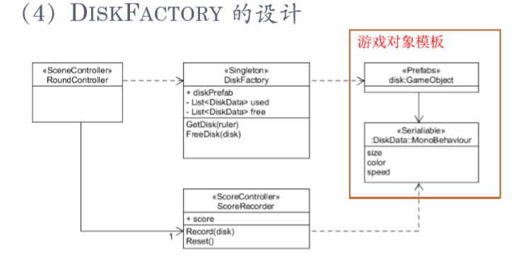
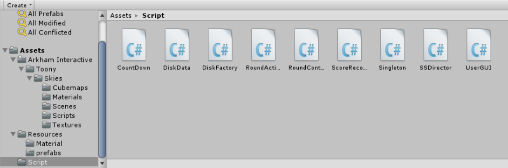
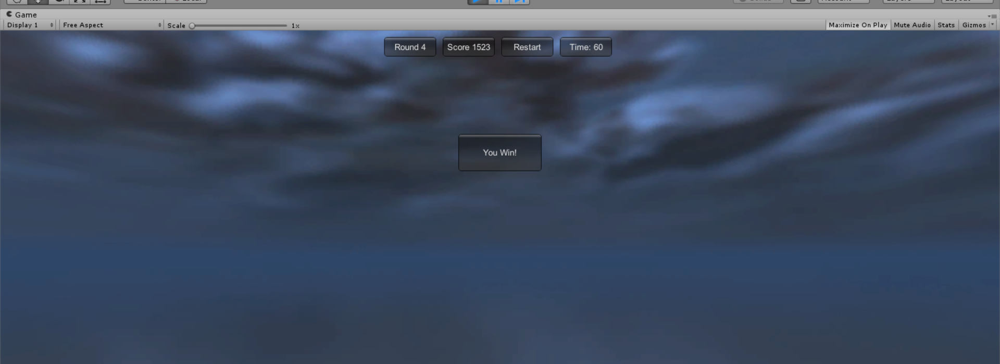

# 打飞碟（Hit UFO）游戏


## 内容要求
- 游戏有 n 个 round，每个 round 都包括10 次 trial；
- 每个 trial 的飞碟的色彩、大小、发射位置、速度、角度、同时出现的个数都可能不同。它们由该 round 的 ruler 控制；
- 每个 trial 的飞碟有随机性，总体难度随 round 上升；
- 鼠标点中得分，得分规则按色彩、大小、速度不同计算，规则可自由设定
## 游戏要求
- 使用带缓存的工厂模式管理不同飞碟的生产与回收，该工厂必须是场景单实例的
- 近可能使用前面 MVC 结构实现人机交互与游戏模型分离
## 工厂模式
> 飞碟工厂的设计模式是单实例的工厂,分数和场景控制及各种预制的分离和使用  


## 游戏规则
- 每个回合60s，玩过3关之后胜利
- 飞碟不同的颜色，大小对应不同的分数
- 回合60s内达到500分进入下一关，不能达到500分则失败

## 游戏实现
### 代码结构

### 导演类
```C#
public class SSDirector : System.Object
{
	public static SSDirector _instance;
	public ISceneController currentScenceController { get; set; }
	public bool running { get; set; }
	public static SSDirector getInstance()
	{
		if (_instance == null)
		{
			_instance = new SSDirector();
		}
		return _instance;
	}
	public int getFPS()
	{
		return Application.targetFrameRate;
	}
	public void setFPS(int fps)
	{
		Application.targetFrameRate = fps;
	}
	public void NextScene()
	{
		Debug.Log("no next scene");
	}
}
```
### 飞碟工厂的实现：工厂里面实现功能:GetDisk()和FreeDisk()
>飞碟工厂类，在场景控制器需要某种飞碟的时候，飞碟工厂从仓库(List <Gameobject> free)中获取这种飞碟，如果仓库中没有，则实例化一个新飞碟，然后添加used list 中
当场景控制器发现飞碟被打中或者飞碟掉出摄像机视野外，将执行回收飞碟,在used list 删除飞碟，然后将该飞碟的数据添加到free_list中循环利用

- 伪代码设计
```C#
GetDisk()  
IF (free list has disk)   
THEN      
    a_disk = remove one from list   
ELSE      
    a_disk = clone from Prefabs   
ENDIF   
Set Disk_Data of a_disk with the ruler  
Add a_disk to used list   
Return a_disk    
 
FreeDisk() 
Find disk in used list   
IF (not found)   
THEN Remove exception   
Move disk from used to free list 
```
- 代码实现
```C#
public class DiskFactory : MonoBehaviour {

	private List<GameObject> used = new List<GameObject>();
	private List<GameObject> free = new List<GameObject>();

	private Color[] color = { Color.red, Color.green, Color.blue, Color.yellow };

	public GameObject GetDisk(int ruler)
	{
		GameObject a_disk;
		if (free.Count > 0)
		{
			a_disk = free[0];
			free.Remove(free[0]);
		}
		else
		{
			a_disk = GameObject.Instantiate(Resources.Load("prefabs/Disk")) as GameObject;
			Debug.Log(a_disk);
		}

		a_disk.GetComponent<DiskData>().size = UnityEngine.Random.Range(0, 7-ruler);
		a_disk.GetComponent<DiskData>().color = color[UnityEngine.Random.Range(0, 4)];
		a_disk.GetComponent<DiskData>().speed = UnityEngine.Random.Range(5+ruler, 8+ruler);

		a_disk.transform.localScale = new Vector3(a_disk.GetComponent<DiskData>().size * 2, a_disk.GetComponent<DiskData>().size * 0.1f, a_disk.GetComponent<DiskData>().size * 2);
		a_disk.GetComponent<Renderer>().material.color = a_disk.GetComponent<DiskData>().color;
		a_disk.SetActive(true);

		used.Add(a_disk);
		return a_disk;
	}
		
	public void FreeDisk(GameObject disk)
	{
		for(int i = 0; i < used.Count; i++)
		{
			if(used[i] == disk)
			{
				disk.SetActive(false);
				used.Remove(used[i]);
				free.Add(disk);
			}
		}
	}
}
```
- 飞碟数据由round的ruler控制
```C#
a_disk.GetComponent<DiskData>().size = UnityEngine.Random.Range(0, 7-ruler);
a_disk.GetComponent<DiskData>().color = color[UnityEngine.Random.Range(0, 4)];
a_disk.GetComponent<DiskData>().speed = UnityEngine.Random.Range(10+ruler, +ruler);
```
### 场景控制类
- 场景单实例,运用模板，可以为每个 MonoBehaviour子类 创建一个对象的实例  

```C#
public class Singleton<T> where T : MonoBehaviour
{
	private static T instance;
	public static T Instance{
		get{
			if (instance == null){
				instance = (T)Object.FindObjectOfType(typeof(T));
				if (instance == null){
					Debug.LogError("Can't find instance of " + typeof(T));
				}
			}
			return instance;
		}
	}
}
```
- 射击条件
```C#
public void shoot()
{
	if (Input.GetMouseButtonDown(0) && (state == State.START || state ==State.CONTINUE))
	{
		Ray ray = Camera.main.ScreenPointToRay(Input.mousePosition);
		RaycastHit hit;
		if (Physics.Raycast(ray, out hit))
		{
			if ((SSDirector.getInstance().currentScenceController.state ==State.START || SSDirector.getInstance().currentScenceController.state== State.CONTINUE))
			{
				shootAtSth = hit.transform.gameObject;
				explosion.transform.position =hit.collider.gameObject.transform.position;
				explosion.GetComponent<Renderer>().material =hit.collider.gameObject.GetComponent<Renderer>().material;
				explosion.GetComponent<ParticleSystem>().Play();
			}
		}
	}
}
```
- 加载飞碟,从飞碟工厂得到飞碟并将飞碟加入场景
- 检查飞碟是否需要回收
- 判断游戏状态

```C#
	public void Judge()
	{
		if(shootAtSth != null && shootAtSth.transform.tag == "Disk" && shootAtSth.activeInHierarchy)
		{
			scoreRecorder.Record(shootAtSth);
			diskFactory.FreeDisk(shootAtSth);
			shootAtSth = null;
		}

		if(scoreRecorder.getScore() > 500 * round)
		{
			round++;
			leaveSeconds = count = 60;
		}

		if (round == 4) 
		{
			StopAllCoroutines();
			state = State.WIN;
		}
		else if (leaveSeconds == 0 && scoreRecorder.getScore() < 500 * round) 
		{
			StopAllCoroutines();
			state = State.LOSE;
		} 
		else
			state = State.CONTINUE;

	}
```

### 动作管理类RoundActionManager（）
```C#
public class RoundActionManager : SSActionManager, ISSActionCallback
{
	public RoundController scene;
	public MoveToAction action1, action2;
	public SequenceAction saction;
	float speed;


	public void addRandomAction(GameObject gameObj)
	{
		int[] X = { -20, 20 };
		int[] Y = { -5, 5 };
		int[] Z = { -20, -20 };

		Vector3 starttPos = new Vector3(
			UnityEngine.Random.Range(-20, 20),
			UnityEngine.Random.Range(-5, 5),
			UnityEngine.Random.Range(50, 10)
		);

		gameObj.transform.position = starttPos;

		Vector3 randomTarget = new Vector3(
			X[UnityEngine.Random.Range(0, 2)],
			Y[UnityEngine.Random.Range(0, 2)],
			Z[UnityEngine.Random.Range(0, 2)]
		);

		MoveToAction action = MoveToAction.getAction(randomTarget, gameObj.GetComponent<DiskData>().speed);

		RunAction(gameObj, action, this);
	}

	protected  void Start()
	{
		scene = (RoundController)SSDirector.getInstance().currentScenceController;
		scene.actionManager = this;
	}

	protected new void Update()
	{
		base.Update();
	}

	public void actionDone(SSAction source)
	{
		Debug.Log("Done");
	}
}
```
### UI实现(代码详见[/asset/script/UserGUI.cs](https://github.com/syh1101/3DGame-homework/blob/master/homework5/hit_UFO/Assets/Script/UserGUI.cs))
### 积分规则
> 飞碟速度越快,体积越小,得到的分数就越高,不同颜色的飞碟得分情况的也不同
```C#
public class ScoreRecorder : MonoBehaviour {
	private float score;

	public float getScore()
	{
		return score;
	}

	public void Record(GameObject disk)
	{
		score += (100 - disk.GetComponent<DiskData>().size *(20 - disk.GetComponent<DiskData>().speed));

		Color c = disk.GetComponent<DiskData>().color;
		switch (c.ToString())
		{
		case "red":
			score += 250;
			break;
		case "green":
			score += 200;
			break;
		case "blue":
			score += 150;
			break;
		case "yellow":
			score += 100;
			break;
		}
	}
```


## 游戏运行截图


[项目链接](https://github.com/syh1101/3DGame-homework/tree/master/homework5)  
[视频演示链接](http://m.v.qq.com/play/play.html?vid=o3006zqj2ba&ptag=4_7.6.0.22280_copy)  
[博客链接](https://blog.csdn.net/Passenger317_/article/details/102472275)  
## 参考资料
[感谢此篇参考博客](https://blog.csdn.net/hellowangld/article/details/79980641)  
[爆炸效果学习](https://blog.csdn.net/jukaiblog/article/details/10343211?locationNum=11&fps=1)


