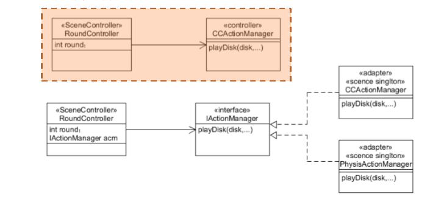
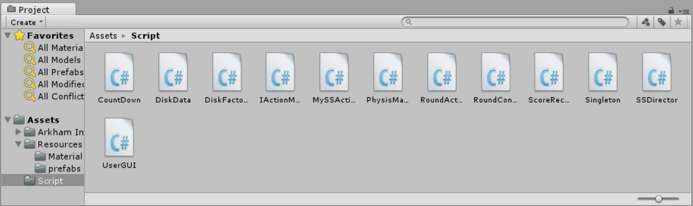
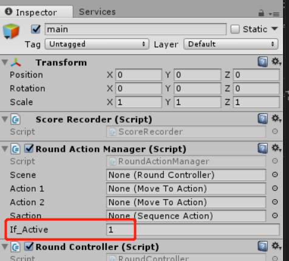
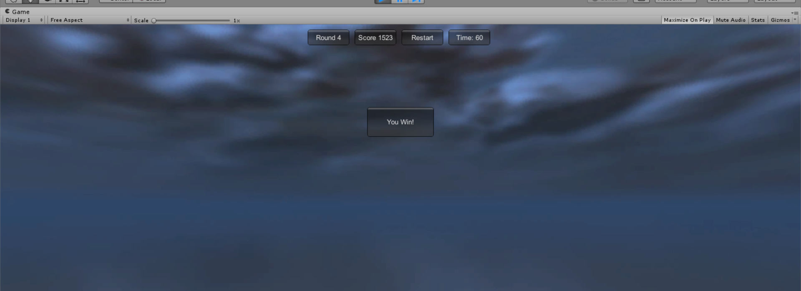

# 打飞碟（Hit UFO）游戏改进版
## 内容要求
- 按 adapter模式 设计图修改飞碟游戏
- 使它同时支持物理运动与运动学（变换）运动

## 适配器模式
- 适配器模式将某个类的接口转换成另一个接口表示，目的是兼容性，让原本因接口不匹配的不能工作的类可以协同工作

- 对动作管理运用类适配器模式，设计运动学适配器RoundActionManager和物理运动适配器PhysisManager，这两个适配器实现了同一接口IActionManager，IActionManager提供了一个简单动作方法，用于执行抛出飞碟的动作。
```C#
public interface IActionManager{
	void addRandomAction (GameObject gameObj);
}
```

## 游戏规则
- 每个回合60s，玩过3关之后胜利
- 飞碟不同的颜色，大小对应不同的分数
- 回合60s内达到500分进入下一关，不能达到500分则失败
### 代码结构

## 游戏改进实现

- 大部分代码不需要做修改  

- 将原来的RoundActionManager里面的addRandomAction写入到PhysisManager作为接口函数，我们在这个函数中为飞碟添加一个随机方向的外力便可以达到改进效果，实现飞碟的物理学运动学飞行，在进行工厂模式和适配者模式的切换的时候，我们添加了变量If_Active,当If_Active=1的时候，我们切换到物理学运动模式，并将PysisManager脚本挂载到main对象中运行游戏  

  

场景控制器中为PysisManager添加实例：
```C#
$ physisManager = Singleton<PhysisManager>.Instance;
```
```C#
void Awake()
{
	SSDirector director = SSDirector.getInstance();
	director.setFPS(60);
	director.currentScenceController = this;
	LoadResources();
	diskFactory = Singleton<DiskFactory>.Instance;
	scoreRecorder = Singleton<ScoreRecorder>.Instance;
	actionManager = Singleton<RoundActionManager>.Instance;
	physisManager = Singleton<PhysisManager>.Instance;
	leaveSecond2 = 60;
	state = State.PAUSE;
	disks = new List<GameObject>();
}
```

- 由于PhysiscActionManager要用到FixedUpdate方法，所以要对SSAction（作用）、SSActionManager（作用）添加FixedUpdate，方法与Update相同
```C#
public class SSAction : ScriptableObject
{

	public bool enable = true;
	public bool destroy = false;

	public GameObject gameObject { get; set; }
	public Transform transform { get; set; }
	public ISSActionCallback callback { get; set; }

	public virtual void Start()
	{
		throw new System.NotImplementedException();
	}

	public virtual void Update()
	{
		throw new System.NotImplementedException();
	}
	public virtual void FixedUpdate()
	{
		throw new System.NotImplementedException();
	}
}
```
```C#
public class SSActionManager : MonoBehaviour
{
	···
	protected void FixedUpdate()
	{
		foreach (SSAction ac in waitingToAdd)
		{
			actions[ac.GetInstanceID()] = ac;
		}
		waitingToAdd.Clear();

		foreach (KeyValuePair<int, SSAction> kv in actions)
		{
			SSAction ac = kv.Value;
			if (ac.destroy)
			{
				watingToDelete.Add(ac.GetInstanceID());
			}
			else if (ac.enable)
			{
				ac.Update();
			}
		}

		foreach (int key in watingToDelete)
		{
			SSAction ac = actions[key];
			actions.Remove(key);
			DestroyObject(ac);
		}
		watingToDelete.Clear();
	}
	···
}
```


### 其他代码
详见[项目链接](https://github.com/syh1101/3DGame-homework/tree/master/homework6)


## 游戏运行截图


[项目链接](https://github.com/syh1101/3DGame-homework/tree/master/homework6)  
[视频演示链接](https://v.qq.com/x/page/h3009r16560.html?&ptag=4_7.6.0.22280_copy)  
[博客链接](https://blog.csdn.net/Passenger317_/article/details/102602539)  
## 参考资料
感谢此篇[参考博客](https://blog.csdn.net/z_j_q_/article/details/80040424)  


