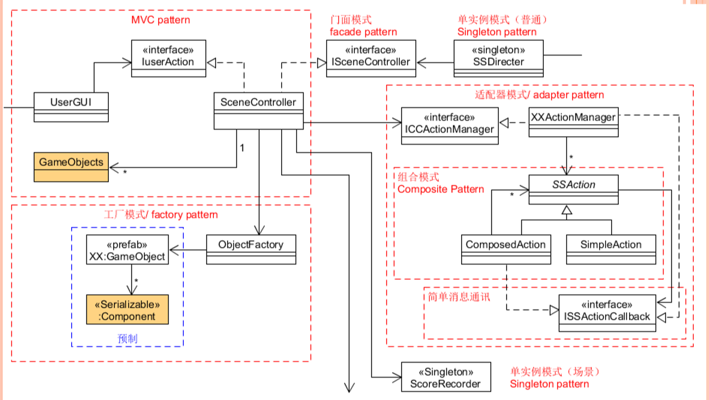
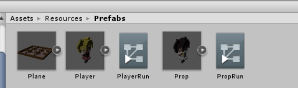
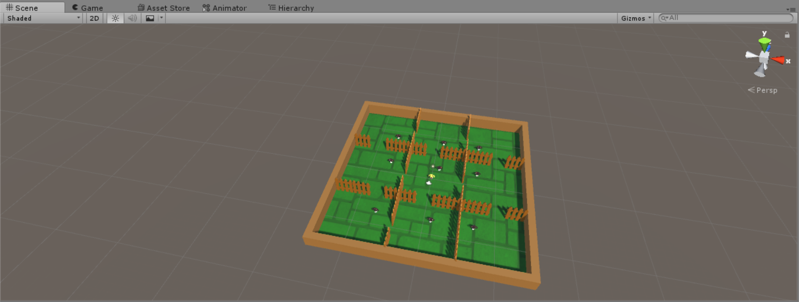
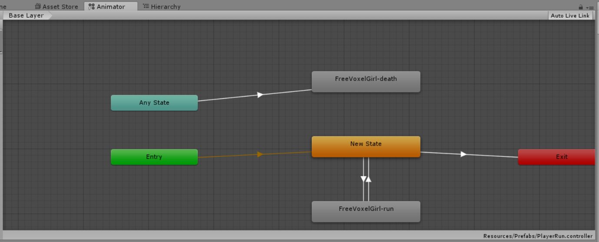
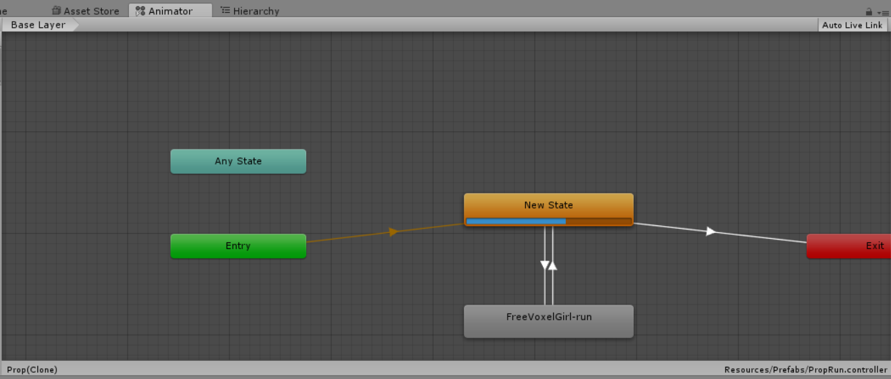
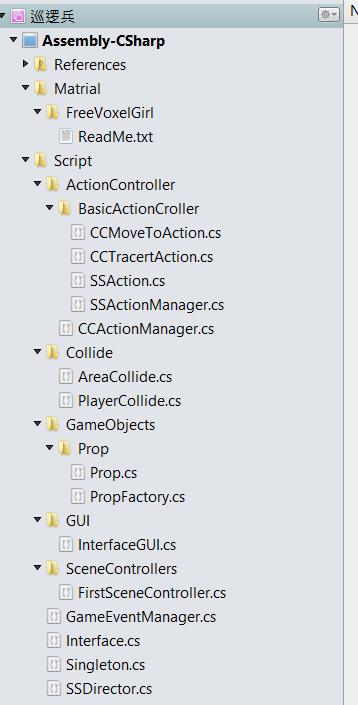

<font size=6>智能巡逻兵</font>

## 游戏设计要求
- 创建一个地图和若干巡逻兵(使用动画)；
- 每个巡逻兵走一个3~5个边的凸多边型，位置数据是相对地址。即每次确定下一个目标位置，用自己当前位置为原点计算；
- 巡逻兵碰撞到障碍物，则会自动选下一个点为目标；
- 巡逻兵在设定范围内感知到玩家，会自动追击玩家；
- 失去玩家目标后，继续巡逻；
- 计分：玩家每次甩掉一个巡逻兵计一分，与巡逻兵碰撞游戏结束；
## 程序设计要求
- 必须使用订阅与发布模式传消息
- 工厂模式生产巡逻兵
## 游戏玩法介绍
&emsp;玩家通过上下左右方向箭头来控制玩家移动，地图每个隔间都有一个巡逻兵，靠近巡逻兵的时候，巡逻兵会追击玩家，甩掉巡逻兵，分数加1，若被巡逻兵追到，则游戏结束
## 游戏组织结构
&emsp;使用动作分离，MVC模式和工厂模式，订阅与发表模式



## 游戏对象预制

## 游戏场景


### 游戏对象动画状态机
- 玩家  


- 巡逻兵  


### 代码组织结构




### 巡逻兵工厂
&emsp;使用工厂模式来管理游戏对象的生成;工厂是单例模式，只进行一次实例化。
巡逻兵初始的位置是设定好的，游戏开始巡逻兵随机巡逻
```C#
public class PropFactory {
    
    public static PropFactory PF = new PropFactory();
    private Dictionary<int, GameObject> used = new Dictionary<int, GameObject>();

    private PropFactory(){}
    int[] pos_x = { -7, 1, 7 };
    int[] pos_z = { 8, 2, -8 };
    public Dictionary<int, GameObject> GetProp()
    {
        for(int i = 0; i < 3; i++)
        {
            for(int j = 0; j < 3; j++)
            {
                GameObject newProp = GameObject.Instantiate<GameObject>(Resources.Load<GameObject>("Prefabs/Prop"));
                newProp.AddComponent<Prop>();
                newProp.transform.position = new Vector3(pos_x[j], 0, pos_z[i]);
                newProp.GetComponent<Prop>().block = i * 3 + j;
                newProp.SetActive(true);
                used.Add(i*3+j, newProp);
            }
        }
        return used;
    }

    public void StopPatrol()
    {
        for (int i = 0; i < 3; i++)
        {
            for(int j = 0; j < 3; j++)
            {
                used[i * 3 + j].transform.position = new Vector3(pos_x[j], 0, pos_z[i]);
            }
        }
    }
}


```

### 接口类
&emsp;UserAction类中主要为GUI和场景控制器交互的的方法，SSActionCallback中为运动控制器的回调函数
```C#
namespace Interfaces
{
    public interface ISceneController
    {
        void LoadResources();
    }

    public interface UserAction
    {
        int GetScore();
        void Restart();
        bool GetGameState();
        void MovePlayer(float translationX, float translationZ);
    }

    public enum SSActionEventType : int { Started, Completed }

    public interface SSActionCallback
    {
        void SSActionCallback(SSAction source);
    }
}
```
### 场景控制器  

&emsp;FirstSceneController类继承了接口ISceneController和UserAction，并且在其中实现了接口声明的函数。场景控制器作为订阅者，初始化时将自身相应事件处理函数提交给消息处理器，在相应事件发生时被自动调用

```C#
public class FirstSceneController : MonoBehaviour, ISceneController, UserAction
{
    GameObject player = null;
    PropFactory PF;
    int score = 0;
    int PlayerArea = 4;
    bool gameState = false;
    Dictionary<int, GameObject> allProp = null;
    CCActionManager CCManager = null;

    void Awake()
    {
        SSDirector director = SSDirector.getInstance();
        director.currentScenceController = this;
        PF = PropFactory.PF;
        if(CCManager == null) CCManager = gameObject.AddComponent<CCActionManager>();
        if (player == null && allProp == null)
        {
            Instantiate(Resources.Load<GameObject>("Prefabs/Plane"), new Vector3(0, 0, 0), Quaternion.identity);
            player = Instantiate(Resources.Load("Prefabs/Player"), new Vector3(0, 0, 0), Quaternion.identity) as GameObject;
            allProp = PF.GetProp();
        }
        if (player.GetComponent<Rigidbody>())
        {
            player.GetComponent<Rigidbody>().freezeRotation = true;
        }
    }
	void Update () {
        if (player.transform.localEulerAngles.x != 0 || player.transform.localEulerAngles.z != 0)
        {
            player.transform.localEulerAngles = new Vector3(0, player.transform.localEulerAngles.y, 0);
        }
        if (player.transform.position.y <= 0)
        {
            player.transform.position = new Vector3(player.transform.position.x, 0, player.transform.position.z);
        }
    }

    void OnEnable()
    {
        GameEventManager.ScoreChange += AddScore;
        GameEventManager.GameoverChange += Gameover;
    }

    void OnDisable()
    {
        ···
    }

    public void LoadResources()
    {
        ···  
    }

    public int GetScore()
    {
        return score;
    }

    public void Restart()
    {
        player.GetComponent<Animator>().Play("New State");
        PF.StopPatrol();
        gameState = true;
        score = 0;
        player.transform.position = new Vector3(0, 0, 0);
        allProp[PlayerArea].GetComponent<Prop>().follow_player = true;
        CCManager.Tracert(allProp[PlayerArea], player);
        foreach (GameObject x in allProp.Values)
        {
            if (!x.GetComponent<Prop>().follow_player)
            {
                CCManager.GoAround(x);
            }
        }
    }

    public bool GetGameState()
    {
        return gameState;
    }
    public void SetPlayerArea(int x)
    {
        ···
    }

    void AddScore()
    {
        ···
    }

    void Gameover()
    {
        ···
    }
		
    public void MovePlayer(float translationX, float translationZ)
    {
        if (gameState&&player!=null)
        {
            if (translationX != 0 || translationZ != 0)
            {
                player.GetComponent<Animator>().SetBool("run", true);
            }
            else
            {
                player.GetComponent<Animator>().SetBool("run", false);
            }
            player.transform.Translate(0, 0, translationZ * 4f * Time.deltaTime);
            player.transform.Rotate(0, translationX * 50f * Time.deltaTime, 0);
        }
    }
}
```
### GUI
&emsp;实现分数和时间显示，游戏结束显示重新开始
```C#
public class InterfaceGUI : MonoBehaviour {
    UserAction UserActionController;
    ISceneController SceneController;
    public GameObject t;
    bool ss = false;
    float S;
    void Start () {
        UserActionController = SSDirector.getInstance().currentScenceController as UserAction;
        SceneController = SSDirector.getInstance().currentScenceController as ISceneController;
        S = Time.time;
    }
    private void OnGUI()
    {
        if(!ss) S = Time.time;
        GUI.Label(new Rect(Screen.width -160, 30, 150, 30),"Score: " + UserActionController.GetScore().ToString() + "  Time:  " + ((int)(Time.time - S)).ToString());
        if (ss)
        {
            if (!UserActionController.GetGameState())
            {
                ss = false;
            }
        }
        else
        {
            if (GUI.Button(new Rect(Screen.width / 2 - 30, Screen.height / 2 - 30, 100, 50), "Start"))
            {
                ss = true;
                SceneController.LoadResources();
                S = Time.time;
                UserActionController.Restart();
            }
        }
    }
    private void Update()
    {

        float translationX = Input.GetAxis("Horizontal");
        float translationZ = Input.GetAxis("Vertical");
        UserActionController.MovePlayer(translationX, translationZ);
    }
}

```

### 事件管理器GameEventManager
- 游戏事件管理器是订阅与发布模式中的中继者，消息的订阅者通过与管理器中相应的事件委托绑定，在管理器相应的函数被发布者调用，订阅者绑定的相应事件处理函数也会被调用。
- 此游戏中需要委托的事件有:计分委托,游戏结束委托,player逃离，player被捕
```c#
public class GameEventManager
{
    public static GameEventManager Instance = new GameEventManager();
    public delegate void ScoreEvent();
    public static event ScoreEvent ScoreChange;
    public delegate void GameoverEvent();
    public static event GameoverEvent GameoverChange;

    private GameEventManager() { }

    public void PlayerEscape()
    {
        if (ScoreChange != null)
        {
            ScoreChange();
        }
    }
    public void PlayerGameover()
    {
        if (GameoverChange != null)
        {
            GameoverChange();
        }
    }
}
```
### 区域碰撞，巡逻兵碰撞
&emsp;有对象进入该区域的时候，判断是否为player，若是，则调用事件管理器发布玩家进入新区域的事件，巡逻兵发生碰撞时候，判断对象是否为player，若是，则调用事件管理器发布游戏结束
```C#
public class AreaCollide : MonoBehaviour
{
    public int sign = 0;
    FirstSceneController sceneController;
    private void Start()
    {
        sceneController = SSDirector.getInstance().currentScenceController as FirstSceneController;
    }
    void OnTriggerEnter(Collider collider)
    {
        if (collider.gameObject.tag == "Player")
        {
            sceneController.SetPlayerArea(sign);
            GameEventManager.Instance.PlayerEscape();
        }
    }
}

```
---

```C#
public class PlayerCollide : MonoBehaviour
{

    void OnCollisionEnter(Collision other)
    {
        if (other.gameObject.tag == "Player")
        {
            GameEventManager.Instance.PlayerGameover();
        }
    }
}

```
### 动作管理类

&emsp;实现了巡逻兵的追踪Tracert与巡逻GoAround动作方法，通过回调函数来执行巡逻或在追踪结束进行巡逻
- 追踪动作：传入了追踪者和被追踪的对象也就是玩家对象。创建了追踪事件，在追上玩家或者追踪标志`follow_player`被置为`false`前一直追着玩家,发生碰撞事件，追踪者的标志会被场记设置为false）。

- 巡逻动作：选取在合理范围的位置，朝该位置移动，到达后调用回调函数。
```C#
public class CCActionManager : SSActionManager, SSActionCallback
{
    public SSActionEventType Complete = SSActionEventType.Completed;
    Dictionary<int,CCMoveToAction> actionList = new Dictionary<int, CCMoveToAction>();

    public void Tracert(GameObject p,GameObject player)
    {
        if (actionList.ContainsKey(p.GetComponent<Prop>().block)) actionList[p.GetComponent<Prop>().block].destroy = true;
        CCTracertAction action = CCTracertAction.getAction(player, 0.8f);
        addAction(p.gameObject, action, this);
    }

    public void GoAround(GameObject p)
    {
        CCMoveToAction action = CCMoveToAction.getAction(p.GetComponent<Prop>().block,0.6f,GetNewTarget(p));
        actionList.Add(p.GetComponent<Prop>().block, action);
        addAction(p.gameObject, action, this);
    }

    private Vector3 GetNewTarget(GameObject p)
    {
        ···
    }

    public void StopAll()
    {
        ···
    }

    public void SSActionCallback(SSAction source)
    {
        if(actionList.ContainsKey(source.gameObject.GetComponent<Prop>().block)) actionList.Remove(source.gameObject.GetComponent<Prop>().block);
        GoAround(source.gameObject);
    }
}
```


[演示视频](https://v.qq.com/x/page/o3015gzi88l.html?&ptag=4_7.6.5.22283_copy)  
[博客链接](https://blog.csdn.net/Passenger317_/article/details/102844358)  
十分感谢学长的[参考博客](https://segmentfault.com/a/1190000014830171)
