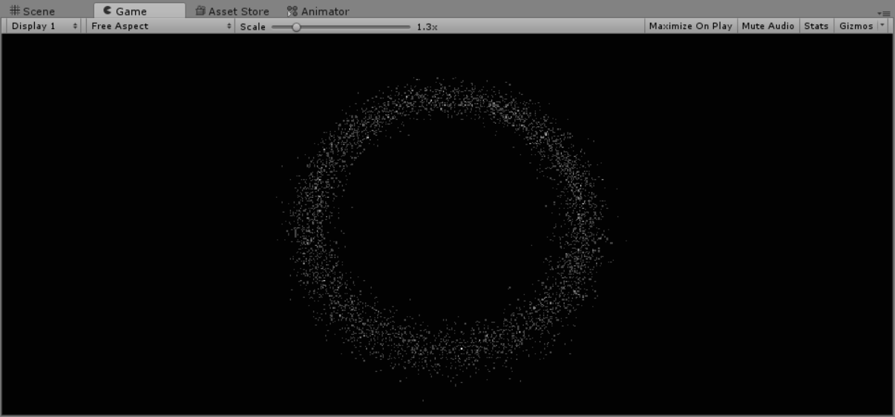
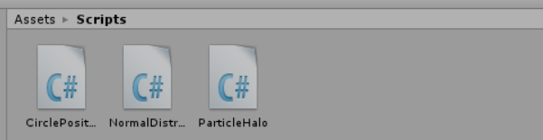
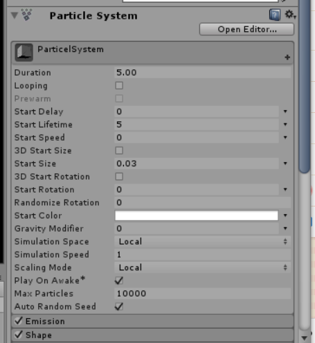

# unity 3D 粒子光环
**什么是粒子系统？**

粒子系统包含基础材料库供用户选择。粒子系统是模拟一些不确定、流动现象的技术。它采用许多形状简单且赋予生命的微小粒子作为基本元素来表示物体(一般由点或很小的多边形通过纹理贴图表示)，表达物体的总体形态和特征的动态变化。  

**作业要求：简单粒子制作**

- 按参考资源要求，制作一个粒子系统，参考资源
- 使用 3.3 节介绍，用代码控制使之在不同场景下效果不一样

**效果图**



**代码结构**



**设计思路**

1. 首先我们定义该例子属性的类，创建CirclePosition，保存我们光环的半径，角度，时间
```C#
public class CirclePosition
{
    public float radius = 0f, angle = 0f, time = 0f;
    public CirclePosition(float radius, float angle, float time)
    {
        this.radius = radius;   // 半径  
        this.angle = angle;     // 角度  
        this.time = time;       // 时间  
    }
}
```
2. 脚本控制，我们把写好的脚本ParticalHalo.cs挂载到空对象ParticleHalo上
首先我们添加粒子系统，例子数组以及粒子属性的数组
```C#
private ParticleSystem particleSys;  // 粒子系统  
private ParticleSystem.Particle[] particleArr;  // 粒子数组  
private CirclePosition[] circle; // 极坐标数组
```
3. 设定好粒子数量大小，光环最大和最小半径，速度,移动范围等信息
```C#
private CirclePosition[] circle; // 极坐标数组
public int count = 10000;       // 粒子数量  
public float size = 0.03f;      // 粒子大小  
public float minRadius = 5.0f;  // 最小半径  
public float maxRadius = 12.0f; // 最大半径  
public bool clockwise = true;   // 顺时针|逆时针  
public float speed = 2f;        // 速度  
public float maxRadiusChange = 0.02f;  // 移动范围
```
- 粒子系统



4. 初始化粒子系统
```C#
void Start()
{   // 初始化粒子数组  
    particleArr = new ParticleSystem.Particl[count];
    circle = new CirclePosition[count];
    // 初始化粒子系统  
    particleSys =this.GetComponent<ParticleSystem>();
    var main = particleSys.main;
    main.startSpeed = 0;              
    main.startSize = size;          // 设置粒子大小
    main.loop = false;
    main.maxParticles = count;      // 设置最大粒量  
    particleSys.Emit(count);               // 发粒子  
    particleSys.GetParticles(particleArr);
    RandomlySpread();   // 初始化各粒子位置  
}
```
5. 使用高斯分布类初始化粒子均匀分布到光环上，然后通过Update使粒子按照设置的半径旋转，并使粒子在半径方向移动,并实现RandomlySpread（）函数
```C#
private int tier = 12;  
void Update()
{
    for (int i = 0; i < count; i++)
    {
        if (clockwise)  // 顺时针旋转  
            circle[i].angle -= (i % tier + 1) *(speed / circle[i].radius / tier);
        else            // 逆时针旋转  
            circle[i].angle += (i % tier + 1) *(speed / circle[i].radius / tier);
        // 保证angle在0~360度  
        circle[i].angle = (360.0f + circle[i.angle) % 360.0f;
        float theta = circle[i].angle / 180 *Mathf.PI;
        particleArr[i].position = new Vector(circle[i].radius * Mathf.Cos(theta), 0f,circle[i].radius * Mathf.Sin(theta));
        particleArr[i].startColor = startColor; 
        circle[i].time += Time.deltaTime;
        circle[i].radius += Mathf.PingPong(circl[i].time / minRadius / maxRadius,maxRadiusChange) - maxRadiusChange / 2.0f;
    }
    particleSys.SetParticles(particleArr,particleArr.Length);
}

void RandomlySpread()
{
    for (int i = 0; i < count; ++i)
    {   
        float midRadius = (maxRadius + minRadius) / 2;
        float radius = (float)normalGenerator.NextGaussian(midRadius, 0.7);
        float angle = Random.Range(0.0f, 360.0f);
        float theta = angle / 180 * Mathf.PI;
        float time = Random.Range(0.0f, 360.0f);    
        float radiusChange = Random.Range(0.0f, maxRadiusChange);   
        circle[i] = new CirclePosition(radius, angle, time);
        particleArr[i].position = new Vector3(circle[i].radius * Mathf.Co(theta), 0f, circle[i].radius * Mathf.Sin(theta));
    }
    particleSys.SetParticles(particleArr, particleArr.Length);
}
```

6. 高斯分布就是在一个圈中以不同密度生成半径
```C#
public double NextGaussian(double mu = 0, double sigma = 1)
    {
        if (sigma <= 0)
            throw new ArgumentOutOfRangeException("sigma", "Must be greater than zero.");
        if (_hasDeviate)
        {
            _hasDeviate = false;
            return _storedDeviate * sigma + mu;
        }
        double v1, v2, rSquared;
        do
        {
            v1 = 2 * _random.NextDouble() - 1;
            v2 = 2 * _random.NextDouble() - 1;
            rSquared = v1 * v1 + v2 * v2;
        } while (rSquared >= 1 || rSquared == 0);
        var polar = Math.Sqrt(-2 * Math.Log(rSquared) / rSquared);
        _storedDeviate = v2 * polar;
        _hasDeviate = true;
        return v1 * polar * sigma + mu;
    }
```


感谢师兄的[博客](https://blog.csdn.net/tangyt77/article/details/80481010)  
效果展示[视频链接](https://v.qq.com/x/page/n30187u2z8d.html?&ptag=4_7.6.5.22283_copy)  
[博客链接](https://blog.csdn.net/Passenger317_/article/details/102953249)