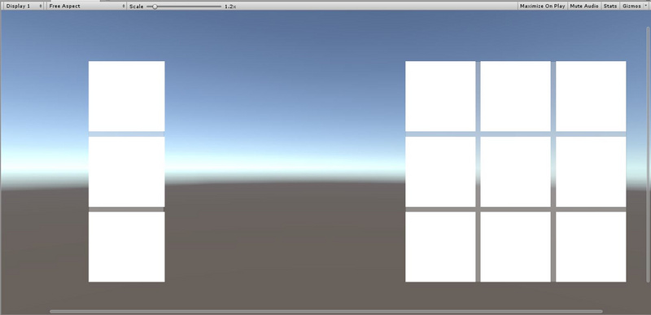
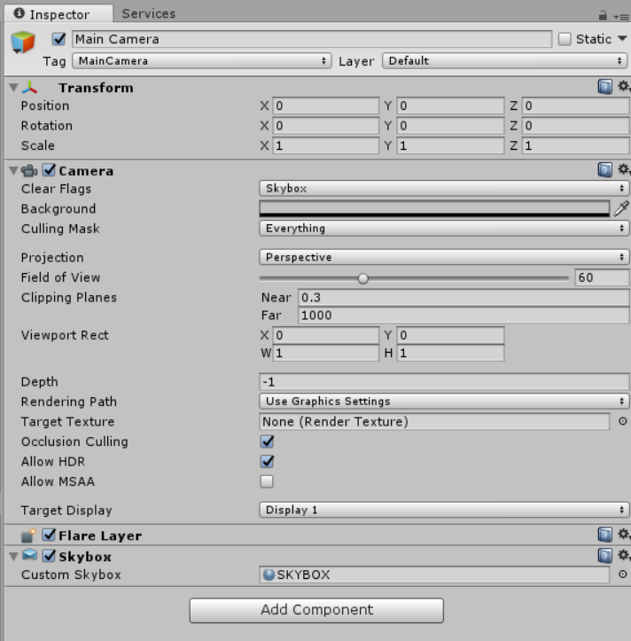
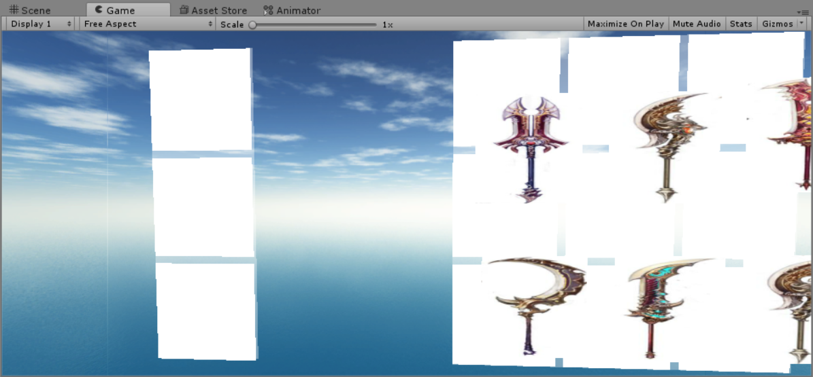

# UGUI实现背包系统
## 实验任务：
使用UGUI实现一个背包系统，包括下列四项效果：
- 实现背包的主要页面
- 背包系统中放置物品的格子和物品图片
- 实现鼠标拖动物体调整背包
- 简单的动画效果
## 实验过程：
1. 添加一个`Canvas`，设置屏幕空间为摄像机，渲染摄像机为主摄像机

2. 建立背包格子，填充`Image`对象  

  

3. 建立脚本获取鼠标位置然后将`Bag`和`Wear`两个物品栏的朝向设为鼠标的方向
```C#
public class FollowMouse : MonoBehaviour {

    public Vector2 range = new Vector2(4f, 2f);
    Transform mTrans;
    Quaternion mStart;
    Vector2 mRot = Vector2.zero;
    void Start()
    {
        mTrans = transform;
        mStart = mTrans.localRotation;
    }
    void Update()
    {
        Vector3 pos = Input.mousePosition;
        float halfWidth = Screen.width * 0.5f;
        float halfHeight = Screen.height * 0.5f;
        float x = Mathf.Clamp((pos.x - halfWidth) / halfWidth, -0.4f, 0.4f);
        float y = Mathf.Clamp((pos.y - halfHeight) / halfHeight, -0.4f, 0.4f);
        mRot = Vector2.Lerp(mRot, new Vector2(x, y), Time.deltaTime * 2f);
        mTrans.localRotation = mStart * Quaternion.Euler(-mRot.y * range.y, -mRot.x * range.x, 0f);
    }
}
```

4. 主摄像机设置，添加游戏对象动画  

  
  

5. 实现背包物品的拖拽  

三个接口`IBeginDragHandler`, `IDragHandler`, `IEndDragHandler`，实现的拖拽类必须继承这些接口，然后再具体实现。这里的实现方法是拖拽物品的`Image`对象，采用新建所有存储物品的`Image`对象，然后直接拖动这些对象的方法  
- `OnBeginDrag`函数显示优先级并记录起点位置
```C#
    public void OnBeginDrag(PointerEventData eventData)
    {
        canvasGroup.blocksRaycasts = false;
        lastEnter = eventData.pointerEnter;
        lastEnterNormalColor = lastEnter.GetComponent<Image>().color;
        originalPosition = myTransform.position;//拖拽前记录起始位置
        gameObject.transform.SetAsLastSibling();//保证当前操作的对象不会被其它对象遮挡住
    }
```
- `OnDrag`函数实现拖拽
```C#
public void OnDrag(PointerEventData eventData)
{
    Vector3 globalMousePos;
    if (RectTransformUtility.ScreenPointToWorldPointInRectangle(myRectTransform, eventData.position, eventData.pressEventCamera, out globalMousePos))
    {
        myRectTransform.position = globalMousePos;
    }
    GameObject curEnter = eventData.pointerEnter;
    bool inItemGrid = EnterItemGrid(curEnter);
    if (inItemGrid)
    {
        Image img = curEnter.GetComponent<Image>();
        lastEnter.GetComponent<Image>().color = lastEnterNormalColor;
        if (lastEnter != curEnter)
        {
            lastEnter.GetComponent<Image>().color = lastEnterNormalColor;
            lastEnter = curEnter;//记录当前物品格子以供下一帧调用
        }
        img.color = highLightColor;
    }
}
```
- `OnEndDrag`函数停止拖拽，对不同的拖拽情况进行判断并处理  
```C#
public void OnEndDrag(PointerEventData eventData)
{
    GameObject curEnter = eventData.pointerEnter;
    if (curEnter == null)
    {
        myTransform.position = originalPosition;
    }
    else
    {
        //移动至物品格子上
        if (curEnter.name == "UI_ItemGrid")
        {
            myTransform.position = curEnter.transform.position;
            originalPosition = myTransform.position;
            curEnter.GetComponent<Image>().color = lastEnterNormalColor;
        }
        else
        {
            //移动至包裹中的其它物品上
            if (curEnter.name == eventData.pointerDrag.name && curEnter != eventData.pointerDrag)
            {
                Vector3 targetPostion = curEnter.transform.position;
                curEnter.transform.position = originalPosition;
                myTransform.position = targetPostion;
                originalPosition = myTransform.position;
            }
            else//拖拽至其它区域
            {
                myTransform.position = originalPosition;
            }
        }
    }
    lastEnter.GetComponent<Image>().color = lastEnterNormalColor;
    canvasGroup.blocksRaycasts = true;
}
```

## 实验效果  
  

[演示视频](https://v.qq.com/x/page/z3025eazzan.html?&ptag=4_7.6.8.22285_copy)


